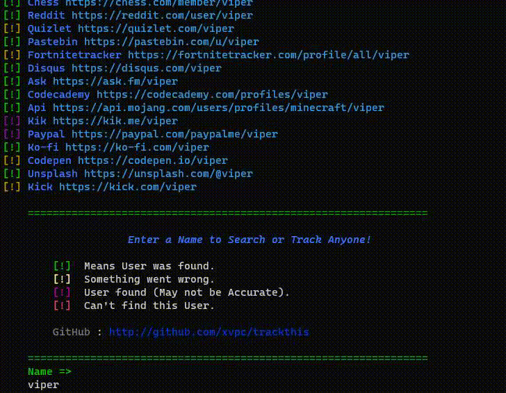

# TrackThis

### A Simple Name Tracker Made using Python.

Just Enter the name you want to search for,    
And the Tool will automatically Fetch the Web and find any relative links.


```ruby
git clone https://github.com/xvpc/trackthis.git
cd trackthis
pip install -r requirements.txt
python main.py
```


<div>
  <!--  -->
  
</div>


<small>©MIT License</small>